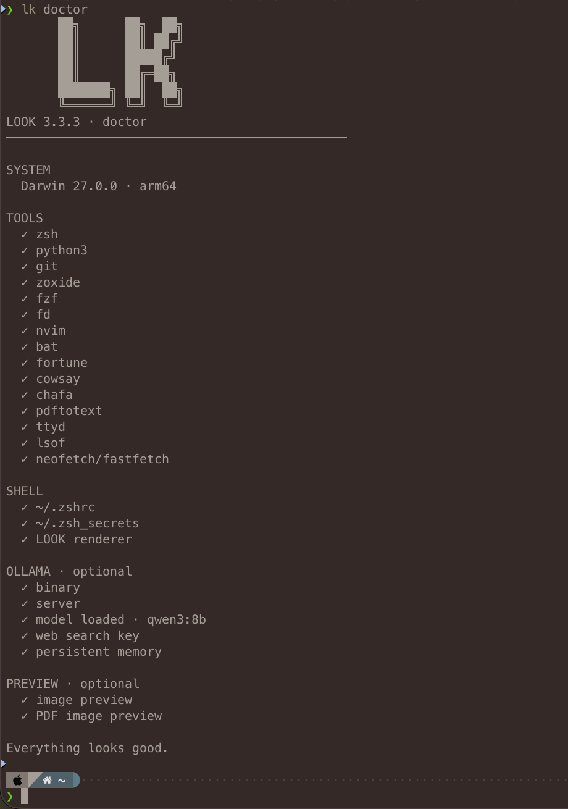
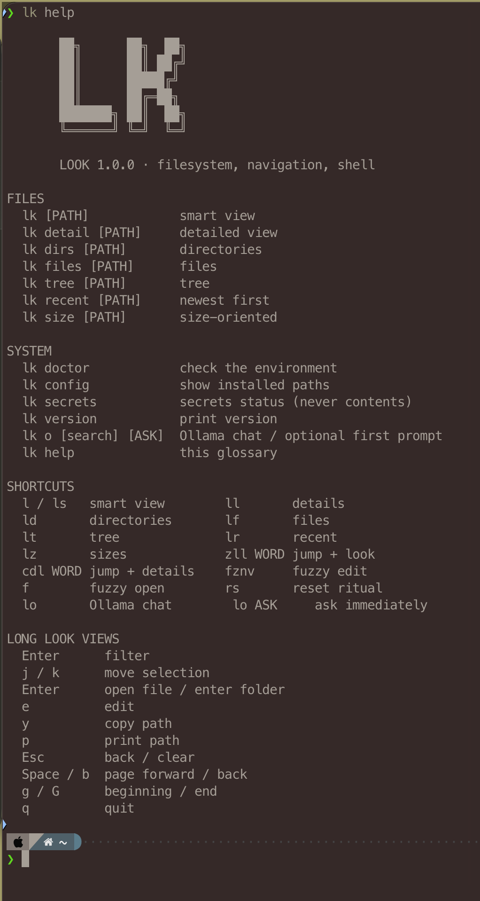

# LOOK Shell

**A small, human-readable inspection layer for the terminal.**

LOOK is a portable personal shell environment for macOS and Linux. It
turns recurring terminal intent into a small human vocabulary: look at
files, a project, a command, a port, the machine, the network, or Ollama
without remembering which Unix machinery answers each question. The
normal Unix shell remains intact underneath it.

It isn't trying to replace the terminal. It's trying to make the
terminal nicer to live in.





## Install

``` sh
chmod +x install.sh
./install.sh --dry-run
./install.sh
exec zsh
lk doctor
```

The installer uses Homebrew/Linuxbrew for LOOK's dependencies, backs up
an existing `.zshrc`, preserves existing secrets, installs LOOK under
`~/.local/share/look`, and exposes `lk` through `~/.local/bin`.

Ollama is optional. LOOK does not install or manage Ollama. Starting `lo` may start a missing **local** Ollama server when the `ollama` binary is installed; `lo --no-start` preserves strict connect-only behavior.

## The basic idea

LOOK started as a better answer to “what’s here?” In 2.0 the same idea
extends to the rest of the computer: **`lk <anything>` means inspect it.**
Paths still get the familiar filesystem renderer. Commands, ports,
processes and named system objects get small purpose-built views.

``` text
lk .                 what's here?
lk python3           how does this command resolve?
lk 8080              what owns this port?
lk run               what can I do in this project?
lk up                what's listening?
lk machine           what machine am I on?
lk net               how am I connected?
```

This is inspection, not management. LOOK does not start services, kill
processes, edit PATH, execute project actions, or replace the Unix tools
it reads from.

## Core commands

``` text
lk [THING]           inspect a path, command, port, or process
lk detail [PATH]     detailed filesystem view
lk dirs/files        directory/file views
lk tree/recent/size  alternate filesystem views

lk run [PATH]       recognize project + show meaningful actions
lk up / ports        listening processes and ports
lk port NUMBER       inspect one port
lk process TERM      find running processes
lk pid NUMBER        inspect one process ID
lk git [PATH]        repository root, branch, remote, changes
lk machine / box     OS, CPU, RAM, disk, GPU capability
lk disk              disk usage
lk gpu               focused GPU status
lk net / network     local network + Tailscale identity
lk tailscale         tailnet status
lk ollama            Ollama binary/server/model status
lk env / path        useful environment + PATH diagnostics
lk why COMMAND       explain executable resolution/conflicts

lk home              friendly terminal home snapshot
lk doctor            environment and capability health
lk config            installed paths and configuration
lk secrets           secrets status, never contents
lk help              full command screen
lk version           installed version
```

The fast filesystem vocabulary is unchanged:

``` text
l                  interactive smart view
ll                 interactive detail view
ld                 interactive directories
lf                 interactive files
lt                 interactive tree
lr                 interactive recent
lz                 interactive size view
zll WORD           zoxide jump + smart view
cdl WORD           zoxide jump + detail view
fznv               fuzzy-find into Neovim
f                  fuzzy helper
lh                 LOOK home
rs                 reset ritual
commands           LOOK help
```

### Inspection grammar

Classification is deliberately conservative. Existing paths win first;
numeric values in the port range are inspected as ports; executable names
are resolved through PATH; then LOOK makes a best-effort process-name match.
Named views such as `git`, `machine`, `gpu`, `net`, `tailscale`, `ollama`,
`env`, and `path` are explicit and predictable.

`lk run` only **suggests** project actions based on markers such as
`package.json`, `pyproject.toml`, `Cargo.toml`, `Makefile`, Docker files,
and `index.html`. It never runs them. `lk up` is the complementary view for
what is already listening.

`lk why COMMAND` is the PATH-debugging view: it reports the selected
executable, symlink target, permissions, and alternate executable matches.
Shell aliases/functions live in the parent Zsh process, so when LOOK cannot
see one it explicitly points you to `type -a COMMAND`.

### Home

`lk home` (or `lh`) clears to a small LOOK landing screen, shows the current folder, Git branch when present, lightweight Ollama status, and a cowsay fortune, then immediately returns to the normal shell prompt. It is a reset surface, not a dashboard or background process. `rs` remains the existing neofetch/fortune/cowsay reset ritual.

`l WORD` is smart navigation. If `WORD` names an explicit directory,
LOOK enters it directly; otherwise zoxide resolves it from your
navigation history and LOOK opens there.

## Interactive LOOK

The short view commands (`l`, `ll`, `ld`, `lf`, `lt`, `lr`, `lz`) keep
LOOK active even when only a few files are present.

Press `Enter` or `/` to begin a live filter. Matching is
substring-based, and multiple words form an order-independent AND
search: `cache safari` finds names containing both terms. In tree mode,
filtering searches recursively through the displayed depth while
retaining parent folders as context.

The highlighted result follows the arrow keys immediately. Wide
terminals place the preview beside the results; narrow terminals place
it below.

``` text
Up / Down    choose highlighted match
PageUp/Down  move through long result sets
Enter        directory: browse deeper · file: open with OS default
E            edit highlighted file
O            open with another installed application
Y            copy absolute path
P            print absolute path and exit
Backspace    delete filter text
Esc          clear / leave filtering
q            quit
```

The capital action keys are intentional: **lowercase letters remain
ordinary filter text.** `E`, `O`, `Y`, and `P` therefore work without
stealing characters from a filename search.

LOOK opens executable files rather than executing them. Running code
remains an explicit shell action.

### Previews

LOOK keeps previews deliberately lightweight:

-   text and source files show bounded text
-   directories show compact contents
-   PDFs show first-page text when `pdftotext` is available
-   images, media, archives, and other binaries show useful type/size
    metadata

`Enter` opens a file with the operating-system default. `O` lets you
choose another installed application for that open without changing the
default association.

## Ollama: `lo`

LOOK includes an optional minimal terminal interface for Ollama. It reuses
a resident model when available and can start a missing local Ollama server
on explicit `lo` use when the binary is installed:

``` sh
lo
lk o
```

Bare `lk ollama` is now the v2 inspection view. `lo` / `lk o` opens the
conversation interface; `lk ollama search ...` or `lk ollama <prompt>`
remain accepted as the long-form chat spelling. If Ollama is reachable,
chat detects the currently loaded model and opens a terminal conversation. You can also supply the first prompt
directly:

``` sh
lo explain this error
```

### Web search

If `OLLAMA_API_KEY` is available in the shell environment, web search
can be exposed to tool-capable models.

``` sh
lo search
lo search latest Ollama changes
```

`lo search` searches first on each turn before answering from current
results. The API key is inherited from the shell and is never stored by
LOOK.

### Workspace awareness

`lo` knows the directory in which it was started and receives a bounded
snapshot of that workspace. Tool-capable models can use a deliberately
small filesystem toolset to:

-   list files and directories
-   read bounded text files
-   search filenames and bounded text content
-   create or write UTF-8 text files when explicitly requested

The tools are rooted to the starting workspace. Paths cannot escape it,
binary and oversized operations are rejected or bounded, existing files
are protected unless replacement is explicitly requested, and arbitrary
shell execution is not exposed.

### Persistent memory

`lo` carries a small amount of memory across sessions: five compressed
recent exchanges plus one rolling long-term summary. When the recent
window fills, the oldest note is folded into long-term memory.

``` text
~/.local/share/look/ollama_memory.json
```

The memory file uses private permissions (`0600`).

LOOK 1.0.1 also shows lightweight activity feedback during synchronous
work:

``` text
· searching
· thinking
· remembering
```

This makes model, search, and post-answer memory work visibly distinct
from a hung terminal. `Ctrl-C` and `Ctrl-D` remain safe exit signals
when control returns to the input prompt.

## Secrets

Real secrets stay in:

``` text
~/.zsh_secrets
```

Only `zsh_secrets.example` belongs in Git. `lk secrets` reports status,
never contents.

## Diagnostics

After installation:

``` sh
lk doctor
```

It reports the core LOOK environment plus optional Ollama state: binary,
local server, loaded model, web-search key, and persistent memory.

For installed paths and configuration:

``` sh
lk config
```

## Requirements

The installer handles LOOK's normal dependencies. The core environment
uses Zsh, Python 3, Git, zoxide, fzf, Neovim, and a handful of small
terminal utilities. Powerlevel10k and the configured Zsh plugins are
installed as part of the shell setup.

Ollama is optional. PDF text previews are enhanced when `pdftotext` is
available.

## LOOK 2.0

**2.0 expands LOOK from “look at files” to “look at the computer.”** The
existing filesystem renderer and short-command muscle memory are preserved.
The new inspection layer adds project/run hints, listeners/ports, Git,
machine/GPU, network/Tailscale, Ollama, environment/PATH, command resolution,
and conservative `lk <anything>` classification. These views are read-only.

## LOOK 1.0

### 1.0.6

Teaches `lo` about its LOOK Shell interface and capabilities. The system context now explicitly describes the supported lightweight Markdown, current-workspace file tools, optional web search, and the boundaries on those capabilities. Markdown `http/https` links are emitted as OSC 8 terminal hyperlinks when supported, so labeled links can be clicked directly in terminals such as iTerm2. No model, memory, search, filesystem-tool, or navigation semantics changed.

### 1.0.3

Fixes Up/Down and PageUp/PageDown handling in the built-in `lk help` pager. Ollama chat output also gains restrained terminal-native ANSI styling: distinct heading levels, italic emphasis, code and links, plus different `you ›` and `lo ›` labels.


**1.0 is the stable interface.** The 0.x releases were the development
path that established the renderer, navigation model, live filtering,
previews, installer, and Ollama integration. The README no longer
carries the entire incremental development log now that the command
vocabulary has settled.

### 1.0.2

Polishes the stable interface without changing LOOK's filesystem behavior. `lk help` and `commands` now document the final `E/O/Y/P` live-filter actions, and the help pager adds `j/k`, arrow keys, PageUp, and PageDown alongside the existing Space/b/g/G controls. `lo` now treats an idle Ollama server as ready-on-demand: it reuses a resident model when present, otherwise uses `LOOK_OLLAMA_MODEL` (default `qwen3:8b`). On explicit `lo` use, LOOK can also start a missing local Ollama server when the binary is installed; `--no-start` disables that convenience.

### 1.0.1

Adds visible `searching`, `thinking`, and `remembering` feedback to
Ollama operations so synchronous work is clearly distinguishable from a
hung terminal. Model, memory, search, and filesystem behavior are
otherwise unchanged.

### 1.0.0

Establishes the stable LOOK filesystem/navigation interface, including
the final live-filter action vocabulary:

``` text
E  edit
O  open with
Y  copy absolute path
P  print absolute path and exit
```

Lowercase characters remain available for filtering.

------------------------------------------------------------------------

LOOK stays intentionally small: Zsh handles navigation and composition,
Python handles filesystem presentation, and the ordinary Unix tools
remain underneath both.


### 1.0.6

Web-backed `lo` answers now preserve the exact URLs returned by search and emit complete Markdown links, preventing citation-looking labels with no real hyperlink target.


### 1.0.6

Terminal polish: web links keep their complete literal URL visible for native terminal detection/copy/open behavior, and `lk help` gains restrained ANSI semantic color. No runtime behavior changes.


### 1.0.7

Fixes `lk help` startup after the 1.0.6 ANSI help-color pass by importing the regular-expression module used by the help formatter.


### 1.0.8

Adds `lk home` / `lh`: a lightweight terminal landing screen with current location, Git/Ollama status, and a cowsay fortune. It exits immediately back to the shell. Help and README are updated; existing `rs` behavior is unchanged.
